# LiveHood Backend Architecture Diagram

```mermaid
graph TB
    %% Frontend Layer
    Frontend[Web/Mobile App]
    
    %% API Layer
    AppSync[AWS AppSync<br/>GraphQL API]
    
    %% Authentication Layer
    Cognito[AWS Cognito<br/>User Pool]
    CognitoGroups[User Groups<br/>- user<br/>- paid<br/>- admin]
    
    %% Lambda Functions - User Management
    PostConfirmLambda[Post Confirmation<br/>Lambda]
    GenerateUserIdLambda[Generate User ID<br/>Lambda]
    CreateDynamoUserLambda[Create DynamoDB User<br/>Lambda]
    CreateS3FolderLambda[Create S3 Folder<br/>Lambda]
    SendWelcomeEmailLambda[Send Welcome Email<br/>Lambda]
    
    %% Lambda Functions - Property Management
    ValidatePropertyLambda[Validate Property Data<br/>Lambda]
    UploadImagesLambda[Upload Images to S3<br/>Lambda]
    SavePropertyLambda[Save Property to DB<br/>Lambda]
    SendApprovalNotificationLambda[Send Approval Notification<br/>Lambda]
    
    %% Lambda Functions - User Upgrade
    UpdateCognitoGroupLambda[Update Cognito Group<br/>Lambda]
    UpdateUserTierLambda[Update User Tier<br/>Lambda]
    SendProWelcomeEmailLambda[Send Pro Welcome Email<br/>Lambda]
    
    %% Lambda Functions - AI Report Generation
    GenerateAIContentLambda[Generate AI Content<br/>Lambda]
    GeneratePDFLambda[Generate PDF<br/>Lambda]
    SavePDFToS3Lambda[Save PDF to S3<br/>Lambda]
    SendReportEmailLambda[Send Report Email<br/>Lambda]
    
    %% Lambda Functions - AppSync Resolvers
    ResolverLambdas[AppSync Resolver Lambdas<br/>- Create/Update/Delete Property<br/>- List Properties<br/>- Get Upload URL<br/>- Generate Report<br/>- Upgrade User]
    
    %% Lambda Functions - Queue Consumers
    AIProcessingConsumer[AI Processing<br/>Consumer Lambda]
    ImageProcessingConsumer[Image Processing<br/>Consumer Lambda]
    
    %% Step Functions
    UserCreationSF[User Creation<br/>State Machine]
    PropertyUploadSF[Property Upload<br/>State Machine]
    UpgradeUserSF[Upgrade User<br/>State Machine]
    ReportGenerationSF[Report Generation<br/>State Machine]
    
    %% SQS Queues
    AIProcessingQueue[AI Processing Queue]
    ImageProcessingQueue[Image Processing Queue]
    AIProcessingDLQ[AI Processing DLQ]
    ImageProcessingDLQ[Image Processing DLQ]
    
    %% Storage Layer
    UserTable[(Users Table<br/>DynamoDB)]
    PropertiesTable[(Properties Table<br/>DynamoDB<br/>+ 5 GSIs)]
    UserFilesBucket[User Files Bucket<br/>S3]
    PropertyImagesBucket[Property Images<br/>Bucket S3]
    
    %% External Services
    Bedrock[AWS Bedrock<br/>Claude 3 Haiku]
    SES[AWS SES<br/>Email Service]
    Resend[Resend API<br/>Email Service]
    
    %% Monitoring
    CloudWatch[CloudWatch<br/>Alarms & Dashboard]
    SNSTopic[SNS Topic<br/>Queue Alarms]
    
    %% Connections
    Frontend --> AppSync
    Frontend --> Cognito
    
    Cognito --> PostConfirmLambda
    Cognito --> CognitoGroups
    PostConfirmLambda --> UserCreationSF
    
    %% User Creation Flow
    UserCreationSF --> GenerateUserIdLambda
    UserCreationSF --> CreateDynamoUserLambda
    UserCreationSF --> CreateS3FolderLambda
    UserCreationSF --> SendWelcomeEmailLambda
    
    CreateDynamoUserLambda --> UserTable
    CreateS3FolderLambda --> UserFilesBucket
    SendWelcomeEmailLambda --> Resend
    
    %% AppSync Connections
    AppSync --> ResolverLambdas
    ResolverLambdas --> PropertiesTable
    ResolverLambdas --> UserTable
    ResolverLambdas --> PropertyUploadSF
    ResolverLambdas --> UpgradeUserSF
    ResolverLambdas --> ReportGenerationSF
    ResolverLambdas --> AIProcessingQueue
    ResolverLambdas --> ImageProcessingQueue
    
    %% Property Upload Flow
    PropertyUploadSF --> ValidatePropertyLambda
    PropertyUploadSF --> UploadImagesLambda
    PropertyUploadSF --> SavePropertyLambda
    PropertyUploadSF --> SendApprovalNotificationLambda
    
    UploadImagesLambda --> ImageProcessingQueue
    SavePropertyLambda --> PropertiesTable
    SendApprovalNotificationLambda --> Resend
    
    %% User Upgrade Flow
    UpgradeUserSF --> UpdateCognitoGroupLambda
    UpgradeUserSF --> UpdateUserTierLambda
    UpgradeUserSF --> SendProWelcomeEmailLambda
    
    UpdateCognitoGroupLambda --> CognitoGroups
    UpdateUserTierLambda --> UserTable
    SendProWelcomeEmailLambda --> Resend
    
    %% Report Generation Flow
    ReportGenerationSF --> GenerateAIContentLambda
    ReportGenerationSF --> GeneratePDFLambda
    ReportGenerationSF --> SavePDFToS3Lambda
    ReportGenerationSF --> SendReportEmailLambda
    
    GenerateAIContentLambda --> Bedrock
    SavePDFToS3Lambda --> UserFilesBucket
    SendReportEmailLambda --> Resend
    
    %% Queue Processing
    AIProcessingQueue --> AIProcessingConsumer
    ImageProcessingQueue --> ImageProcessingConsumer
    AIProcessingDLQ --> AIProcessingQueue
    ImageProcessingDLQ --> ImageProcessingQueue
    
    AIProcessingConsumer --> Bedrock
    AIProcessingConsumer --> UserFilesBucket
    AIProcessingConsumer --> PropertiesTable
    
    ImageProcessingConsumer --> UserFilesBucket
    ImageProcessingConsumer --> PropertiesTable
    
    %% Monitoring
    AIProcessingQueue --> CloudWatch
    ImageProcessingQueue --> CloudWatch
    AIProcessingDLQ --> CloudWatch
    ImageProcessingDLQ --> CloudWatch
    AIProcessingConsumer --> CloudWatch
    ImageProcessingConsumer --> CloudWatch
    CloudWatch --> SNSTopic
    
    %% Styling
    classDef api fill:#ff9999,stroke:#333,stroke-width:2px
    classDef auth fill:#99ccff,stroke:#333,stroke-width:2px
    classDef lambda fill:#ffcc99,stroke:#333,stroke-width:2px
    classDef storage fill:#99ff99,stroke:#333,stroke-width:2px
    classDef queue fill:#ff99ff,stroke:#333,stroke-width:2px
    classDef workflow fill:#ffff99,stroke:#333,stroke-width:2px
    classDef external fill:#cccccc,stroke:#333,stroke-width:2px
    classDef monitoring fill:#99ffcc,stroke:#333,stroke-width:2px
    
    class AppSync api
    class Cognito,CognitoGroups auth
    class PostConfirmLambda,GenerateUserIdLambda,CreateDynamoUserLambda,CreateS3FolderLambda,SendWelcomeEmailLambda,ValidatePropertyLambda,UploadImagesLambda,SavePropertyLambda,SendApprovalNotificationLambda,UpdateCognitoGroupLambda,UpdateUserTierLambda,SendProWelcomeEmailLambda,GenerateAIContentLambda,GeneratePDFLambda,SavePDFToS3Lambda,SendReportEmailLambda,ResolverLambdas,AIProcessingConsumer,ImageProcessingConsumer lambda
    class UserTable,PropertiesTable,UserFilesBucket,PropertyImagesBucket storage
    class AIProcessingQueue,ImageProcessingQueue,AIProcessingDLQ,ImageProcessingDLQ queue
    class UserCreationSF,PropertyUploadSF,UpgradeUserSF,ReportGenerationSF workflow
    class Bedrock,SES,Resend external
    class CloudWatch,SNSTopic monitoring
```

## Architecture Overview

### 1. **Frontend Layer**
- Web/Mobile applications connect to the backend via GraphQL API

### 2. **API Layer**
- **AWS AppSync**: GraphQL API endpoint
- Handles all client requests with real-time subscription support

### 3. **Authentication Layer**
- **AWS Cognito User Pool**: User authentication and authorization
- **User Groups**: Three tiers - user, paid, admin
- Post-confirmation trigger for new user setup

### 4. **Compute Layer**

#### Lambda Functions by Category:

**User Management:**
- Post Confirmation Lambda (Cognito trigger)
- Generate User ID Lambda
- Create DynamoDB User Lambda
- Create S3 Folder Lambda
- Send Welcome Email Lambda

**Property Management:**
- Validate Property Data Lambda
- Upload Images to S3 Lambda
- Save Property to DynamoDB Lambda
- Send Approval Notification Lambda

**User Upgrade:**
- Update Cognito Group Lambda
- Update User Tier Lambda
- Send Pro Welcome Email Lambda

**AI Report Generation:**
- Generate AI Content Lambda
- Generate PDF Lambda
- Save PDF to S3 Lambda
- Send Report Email Lambda

**AppSync Resolvers:**
- CRUD operations for properties
- User management operations
- Report generation triggers

**Queue Consumers:**
- AI Processing Consumer Lambda
- Image Processing Consumer Lambda

### 5. **Orchestration Layer**
- **Step Functions State Machines:**
  - User Creation Workflow
  - Property Upload Workflow
  - User Upgrade Workflow
  - Report Generation Workflow

### 6. **Queue Layer**
- **SQS Queues:**
  - AI Processing Queue (with DLQ)
  - Image Processing Queue (with DLQ)
- Enables asynchronous processing for heavy workloads

### 7. **Storage Layer**
- **DynamoDB Tables:**
  - Users Table (with GSI for cognitoUserId)
  - Properties Table (with 5 GSIs for various queries)
- **S3 Buckets:**
  - User Files Bucket (user documents, reports)
  - Property Images Bucket

### 8. **External Services**
- **AWS Bedrock**: AI content generation using Claude 3 Haiku
- **AWS SES**: Transactional emails
- **Resend API**: Enhanced email delivery

### 9. **Monitoring & Observability**
- **CloudWatch Alarms**: Queue depth, message age, Lambda errors
- **CloudWatch Dashboard**: Real-time metrics visualization
- **SNS Topic**: Alert notifications

## Key Workflows

### User Registration Flow:
1. User signs up via Cognito
2. Post-confirmation Lambda triggers
3. Step Functions orchestrates user setup
4. Creates DynamoDB record, S3 folder, sends welcome email

### Property Upload Flow:
1. User uploads property via AppSync
2. Images sent to Image Processing Queue
3. Property data validated and saved
4. Admin notified for approval

### AI Report Generation Flow:
1. User requests report via AppSync
2. Request sent to AI Processing Queue
3. Consumer generates content using Bedrock
4. PDF created and saved to S3
5. User notified via email

### Benefits of This Architecture:
- **Scalable**: Serverless components auto-scale
- **Resilient**: Dead letter queues, retry logic
- **Cost-effective**: Pay-per-use pricing
- **Maintainable**: Clear separation of concerns
- **Monitored**: Comprehensive alerting and dashboards