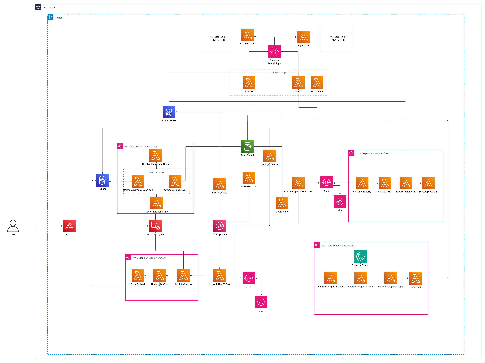

# Real Estate Platform: A Serverless Property Management Solution



## App Info

- **🌐 Live App**: [Your Live App Link Here]
- **📺 Demo Video**: [Watch Demo on YouTube](https://www.youtube.com/watch?v=__fV4ofAd5Q)

For detailed deployment instructions, see [Deployment.md](Deployment.md).

## 🚀 Deployment

For detailed deployment instructions, see [Deployment.md](Deployment.md).

## The Problem We're Solving

_Looking for a new house for our growing family, we quickly discovered the real estate market's biggest pain points:_

**False and misleading listings everywhere.** Many online property listings contain inaccurate information, outdated photos, or properties that aren't even available.

**High brokerage fees.** Standard brokerage fees around 2% add significant costs to already expensive transactions.

**Missing critical data.** It's nearly impossible to find accurate square footage rates and capital appreciation data to make informed decisions.

**Lack of transparency.** The information you need to evaluate properties and neighborhoods simply isn't accessible or reliable.

After experiencing these frustrations firsthand, I built this platform to solve these fundamental issues in the real estate market.

## 🎯 Project Overview

This is a comprehensive real estate property management system built entirely on AWS serverless technologies. Born from the frustration of house hunting with unreliable data and high fees, the platform enables users to list properties with verified information, manage real estate portfolios, generate AI-powered property reports with accurate market data, and handle administrative workflows—all while leveraging the power of AWS Lambda and associated serverless services.

### Lambda Functions Overview

Our application utilizes **25+ Lambda functions** organized into distinct categories:

```
📦 Lambda Functions (25+)
├── 🔐 Authentication & User Management (6)
├── 🏠 Property Management (8)
├── 🤖 AI & Report Generation (4)
├── 📧 Notifications & Events (4)
├── 🛠️ Utility Functions (4)
```

### Lambda Integration Patterns

#### 1. **Synchronous Request-Response Pattern**

Used for real-time operations through AWS AppSync GraphQL API:

```
User Request → AppSync → Lambda Resolver → DynamoDB → Response
```

**Example Functions:**

- `get-property`: Retrieves property details (128MB, 10s timeout)
- `list-properties`: Lists filtered properties (256MB, 30s timeout)
- `get-user-details`: Fetches user profile (128MB, 10s timeout)

#### 2. **Asynchronous Processing Pattern**

Used for time-intensive operations via SQS queues:

```
API Request → Lambda → SQS Queue → Lambda Consumer → Step Functions
```

**Example Flow:**

- `create-property` → SQS → `property-upload-consumer` → Step Functions workflow

#### 3. **Event-Driven Pattern**

Used for reactive processing via EventBridge:

```
State Change → EventBridge → Lambda Handler → Action
```

**Example Functions:**

- `property-approved-handler`: Sends notification when admin approves property
- `property-rejected-handler`: Notifies user of rejection with reasons

#### 4. **Step Functions Orchestration Pattern**

Used for complex multi-step workflows:

```
Step Functions → Lambda 1 → Lambda 2 → Lambda 3 → Complete
```

**Example Workflows:**

- User Creation: `generate-user-id` → `create-dynamodb-user` + `create-s3-folder` → `send-welcome-email`
- Report Generation: `generate-ai-content` → `generate-pdf` → `save-to-s3` → `send-email`

## 📋 How AWS Lambda Was Used

### AppSync Resolvers (GraphQL API Endpoints)

- **`create-property`** - Validates property data and queues it for asynchronous processing via SQS
- **`get-property`** - Retrieves single property details from DynamoDB with authorization checks
- **`list-properties`** - Queries and returns paginated property listings with multiple filter options
- **`list-my-properties`** - Fetches properties owned by the authenticated user using GSI queries
- **`get-user-details`** - Returns user profile information with role-based access control
- **`get-upload-url`** - Generates secure S3 presigned URLs for direct file uploads
- **`approve-property`** - Admin function to approve pending properties and trigger notifications
- **`reject-property`** - Admin function to reject properties with reason tracking
- **`update-property`** - Modifies existing property data with ownership validation
- **`delete-property`** - Removes property and associated resources with authorization
- **`list-pending-properties`** - Admin-only function to retrieve properties awaiting approval
- **`generate-property-report`** - Initiates AI-powered property analysis for paid users
- **`get-report-status`** - Checks the progress of asynchronous report generation
- **`list-my-reports`** - Returns all generated reports for the authenticated user
- **`upgrade-user-to-paid`** - Upgrades user tier and triggers Step Functions workflow

### Step Functions Tasks

- **`generate-user-id`** - Creates unique ULID-based identifier for new users
- **`create-dynamodb-user`** - Persists user profile to DynamoDB with GSI attributes
- **`create-s3-folder`** - Initializes user-specific S3 directory structure
- **`send-welcome-email`** - Sends personalized onboarding email via SES
- **`validate-property-data`** - Performs comprehensive validation on property submissions
- **`upload-images-to-s3`** - Moves images from temp storage to permanent S3 location
- **`save-property-to-dynamodb`** - Stores validated property data with multiple GSI keys
- **`send-pending-approval-notification`** - Notifies admins of new properties to review
- **`generate-ai-content`** - Invokes Bedrock Claude model for property analysis
- **`generate-pdf`** - Converts AI analysis into formatted PDF report
- **`save-pdf-to-s3`** - Stores generated report in secure S3 bucket
- **`send-report-email`** - Delivers report download link to user via email
- **`update-user-tier`** - Modifies user subscription level in DynamoDB
- **`update-cognito-group`** - Synchronizes user permissions in Cognito
- **`send-pro-welcome-email`** - Sends upgrade confirmation with feature guide

### Event Handlers

- **`property-approved-handler`** - Processes approval events and sends success notifications
- **`property-rejected-handler`** - Handles rejection events with reason communication
- **`post-confirmation`** - Triggers user creation workflow after Cognito signup

### Queue Consumers

- **`property-upload-consumer`** - Processes SQS messages to initiate property upload workflow
- **`ai-processing-consumer`** - Handles AI report generation requests from SQS queue

## 🏛️ Architecture Overview

### Serverless Architecture Patterns Implemented

Our architecture embodies several industry-leading serverless patterns:

1. **Event-Driven Architecture**: Loosely coupled components communicate through events via EventBridge
2. **Single Responsibility Pattern**: Each Lambda function serves a single purpose, promoting maintainability
3. **Choreography & Orchestration**: Combining Step Functions for complex workflows with event-driven choreography
4. **Async Request-Reply**: SQS queues decouple time-intensive operations from synchronous API calls
5. **API Pattern**: AppSync provides a unified GraphQL interface for all operations

## 🛠️ AWS Services Utilized

### Core Compute & Orchestration

- **AWS Lambda**: 20+ purpose-built functions implementing single-responsibility architecture
- **AWS Step Functions**: Orchestrating complex multi-step workflows with built-in error handling
- **Amazon SQS**: Decoupling components for resilient async processing
- **Amazon EventBridge**: Event routing for admin operations and system events

### Data & Storage Layer

- **Amazon DynamoDB**: Single-table design with 5 GSIs for efficient querying patterns
- **Amazon S3**: Secure object storage with presigned URLs for direct uploads
- **AWS AppSync**: Managed GraphQL API with real-time capabilities

### Security & Identity

- **Amazon Cognito**: User authentication with group-based authorization

### Infrastructure & Deployment

- **AWS CDK**: Infrastructure as Code for reproducible deployments

### Communication & Notifications

- **Resend API**: Email service integration (Note: For hackathon purposes, the Resend API token has been included with rate limits. This is intentionally done for ease of testing during the hackathon, though I acknowledge this is not a best practice for production environments)

## ✨ Features

### 🔐 User Management & Authentication

- **Multi-tier User System**: Regular users, Pro/Paid users, and Admin users with different access levels
- **Secure Authentication**: AWS Cognito-powered signup/login with email verification
- **Profile Management**: User profiles with personal details and automatic S3 folder creation
- **Seamless Upgrade Path**: One-click upgrade to Pro tier unlocking premium features

### 🏠 Property Management

- **Comprehensive Property Listings**: Create detailed listings with:
  - Property specifications (bedrooms, bathrooms, square feet, etc.)
  - Multiple high-quality image uploads
  - Location details with full address
  - Pricing and property type information
- **Smart Search & Filtering**: Find properties by city, state, price range, property type, and more
- **My Properties Dashboard**: Manage your listed properties in one place
- **Direct Image Upload**: Secure S3 presigned URLs for fast, direct image uploads

### 👨‍💼 Admin Controls

- **Property Verification System**: All listings go through admin approval to ensure quality
- **Approval Workflow**:
  - Review pending properties
  - Approve verified listings
  - Reject with detailed reasons
- **Admin Dashboard**: Dedicated interface for property moderation
- **Event Notifications**: Automatic notifications for property status changes

### 🤖 AI-Powered Property Reports (Pro Feature)

- **Professional Market Analysis**: AI-generated reports using AWS Bedrock (Claude 3)
- **Multiple Report Types**:
  - **Market Analysis**: Local trends, comparable properties, price positioning
  - **Investment Analysis**: ROI projections, cash flow analysis, risk assessment
  - **Comparative Market Analysis (CMA)**: In-depth property comparisons
  - **Listing Optimization**: Pricing recommendations and marketing strategies
  - **Custom Reports**: Tailored analysis based on specific needs
- **Comprehensive Insights**: Neighborhood amenities, schools, transportation, shopping
- **PDF Generation**: Professional reports delivered as downloadable PDFs
- **Report History**: Access all your generated reports anytime

### 📧 Smart Notifications

- **Welcome Emails**: Personalized onboarding for new users
- **Status Updates**: Real-time notifications for property approval/rejection
- **Report Delivery**: Instant notification when AI reports are ready
- **Pro Upgrade Confirmation**: Welcome to premium features
- **Admin Alerts**: Notifications for pending property reviews

### 🚀 Performance & Reliability

- **Asynchronous Processing**: SQS queues ensure smooth operation even during high load
- **Auto-scaling**: Serverless architecture scales automatically with demand
- **Error Handling**: Dead letter queues and retry mechanisms for reliability
- **Real-time Monitoring**: CloudWatch dashboards and alarms for system health

### 🔒 Security & Privacy

- **Role-Based Access Control**: Different permissions for users, Pro users, and admins
- **Secure File Storage**: Private S3 buckets with presigned URLs
- **Owner-Only Access**: Users can only modify their own properties
- **Data Encryption**: All data encrypted at rest and in transit

---

_Built with ❤️ using AWS Serverless Technologies_
